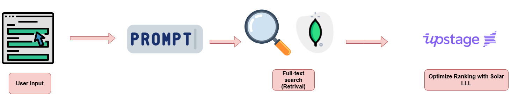
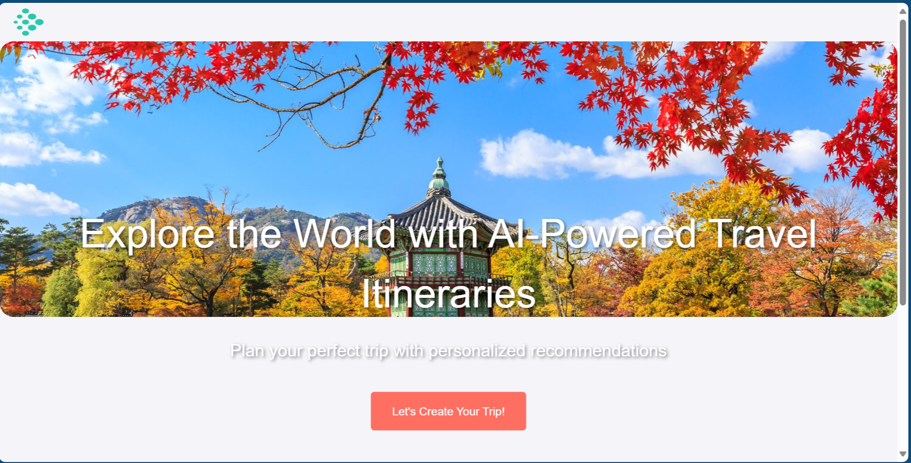
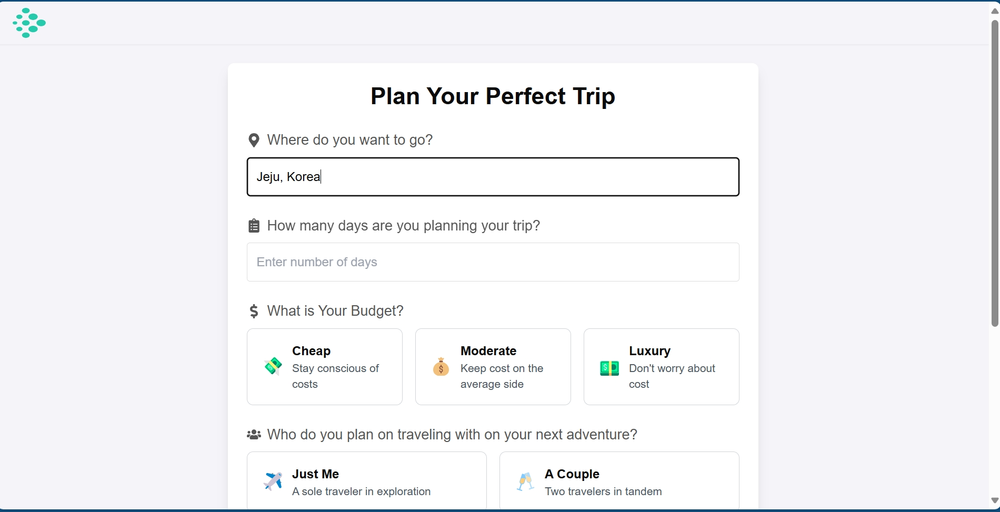
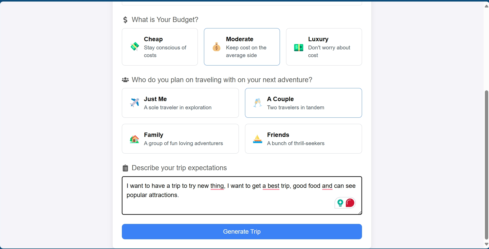
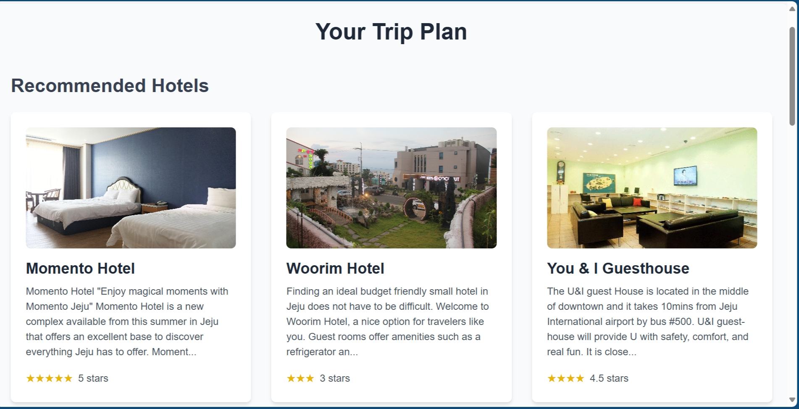
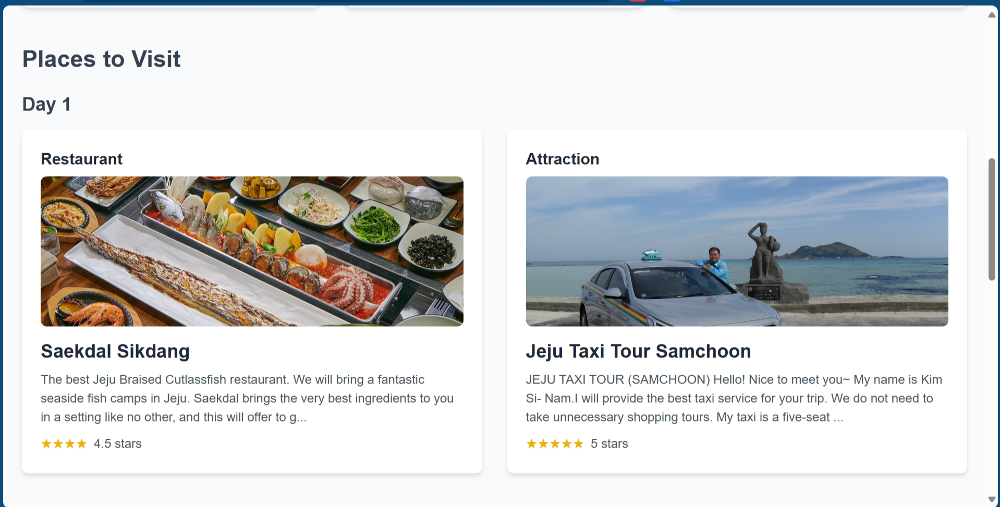
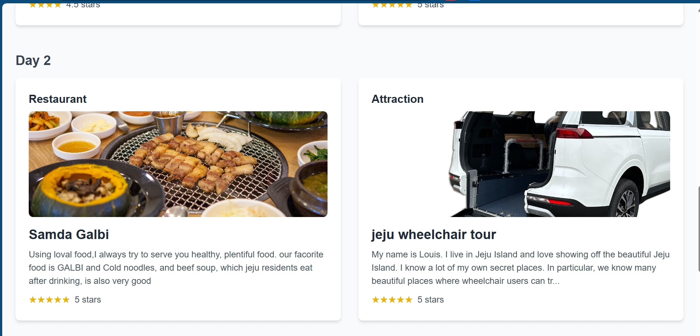

# Explore the World with AI-Powered Travel Itineraries

## Project Overview

"Explore the World with AI-Powered Travel Itineraries" is a web-based application designed to help users plan their perfect trips by generating personalized travel itineraries. The application uses a hybrid search feature to retrieve relevant information about hotels, restaurants, and attractions based on the user's preferences, and ranks them using advanced AI models provided by Upstage API.

### Features

- **Location-Based Search**: Enter your desired location to find the best hotels, restaurants, and attractions.
- **Customizable Preferences**: Tailor your trip based on budget, travel companions, and personal expectations.
- **AI-Powered Recommendations**: Leverage the Upstage API to rank and optimize your travel itinerary.

## System Architecture

## Installation

To run the project locally, follow these steps:

1. **Clone the Repository**:
   ```bash
   git clone https://github.com/YourUsername/Explore-the-World-with-AI-Powered-Travel-Itineraries.git
   cd Explore-the-World-with-AI-Powered-Travel-Itineraries
   ```

2. **Install Dependencies**:
   Ensure you have Node.js installed. Then, install the required packages:
   ```bash
   npm install
   ```

3. **Set Up Environment Variables**:
   Create a `.env` file in the root directory and add your API keys and other environment variables:
   ```bash
   VITE_REACT_APP_UPSTAGE_API_KEY=your_upstage_api_key_here
   ```

4. **Start the Development Server**:
   ```bash
   npm run dev
   ```
   The application should now be running on `http://localhost:5173`.
5. **Start the full text search service MongoDB**
   ```bash
   cd src/model
   python full_text_search.py
   ```
## Usage

1. **Navigate to the Home Page**: On the home page, you can input your trip details, such as location, number of days, budget, companions, and trip expectations.

2. **Generate Itinerary**: Click on the "Generate Trip" button. The application will fetch data from the backend and use the Upstage API to rank the results.

3. **View Results**: You will be redirected to a page showing your customized itinerary, where you can explore the top recommendations for hotels, restaurants, and attractions.

## Upstage API Integration

The project integrates the Upstage API in the following sections:

- **Chat Completion**: The Upstage API is utilized in the `chatCompletion` function located in `src/service/solarLLM.js`. This function sends user input and search results to the Upstage API for ranking and optimizing the travel itinerary.

  ```javascript
  import OpenAI from 'openai';

  const upsage_api = import.meta.env.VITE_REACT_APP_UPSTAGE_API_KEY;
  const openai = new OpenAI({
    apiKey: upsage_api,
    baseURL: 'https://api.upstage.ai/v1/solar',
    dangerouslyAllowBrowser: true
  });

  export const chatCompletion = async (userInput, searchResults) => {
    // Function implementation...
  };
  ```

- **Backend Communication**: The frontend communicates with the backend API to fetch search results, which are then processed and ranked using the Upstage API before being displayed to the user.
- 

## Appendix







## Project GitHub Repository

You can view the entire project source code at [GitHub Repository](https://github.com/YourUsername/Explore-the-World-with-AI-Powered-Travel-Itineraries).

## License

This project is licensed under the MIT License - see the [LICENSE](LICENSE) file for details.
